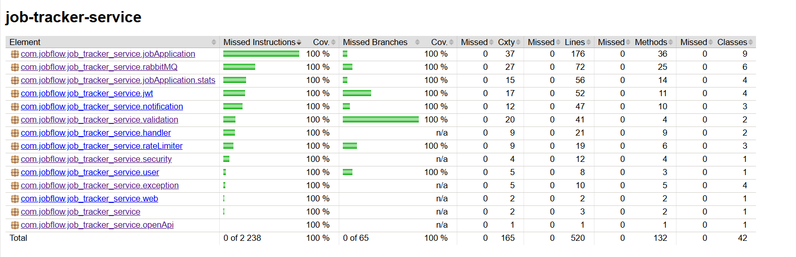

# job-tracker-service

## Description

**job-tracker-service** is the **core service for managing job application statuses** within the JobFlow platform.
It allows users to create, update, and track job applications, providing detailed analytics and progress over time.
The service handles job application events, status changes, and stores relevant information in a database, integrating
with other services to provide a seamless experience for job seekers.

---

## Features

### Job Application Management

- **Create / Update Job Applications** — users can create new applications or update existing ones with status changes,
  positions, and timestamps.
- **Track Application Status** — provides real-time updates on job application progress (applied, viewed, interview,
  offer, etc.).
- **Pagination & Sorting** — allows users to view applications with pagination, filter by status, and sort by creation
  or update date.

### Application Status & Event Publishing

- **Update Application Status** — allows users to update the application status (e.g., applied, viewed, interview,
  offer).
- **Job Application Events** — publishes events for job applications to RabbitMQ, notifying other services (e.g.,
  notification-service).
- **Event-driven Architecture** — supports a strategy pattern for different notification types (e.g., email, Telegram)
  based on job application status changes.

### Analytics & Reporting

- **Job Application Statistics** — provides insights into the user’s job search history, including total applications,
  unique companies, and the top companies/positions.
- **JPQL Queries** - queries for obtaining statistics are implemented in the repository via JPQL
- **Caching for Performance** — application statistics are cached in Redis to improve performance, avoiding
  recalculating statistics repeatedly.
- **Projections for Reports** — optimized queries and projections for generating specific reports like
  `PopularCompanyProjection`.

### Security & Rate Limiting

- **Redis Rate Limiter (Fixed Window)** — limits the number of API calls per user (using userId and IP address) to
  prevent abuse.
- **JWT Authentication** — validates JWT tokens (generated by the user service) using a shared secret key for each
  request to ensure secure and authorized access.
- **RBAC via Spring Security** — resource-level access control to ensure users can only manage their own job
  applications.

### Developer Experience

- **Swagger / OpenAPI 3.0** — Interactive API docs with Swagger.
- **100 % test coverage** — JUnit 5, Mockito, Testcontainers, JaCoCo.
- **Structured logging** — Logback JSON; integrates with ELK stack.

## Installation & Running

This guide helps you run the project from scratch using **Docker Compose**. No pre-installed services required —
everything is containerized.

### 1. Prerequisites

Make sure you have installed:

- [Docker](https://docs.docker.com/get-docker/)
- [Docker Compose](https://docs.docker.com/compose/)

### 2. Clone the Repository

```bash
git clone https://github.com/malyga99/job-flow.git
cd job-flow/job-tracker-service
```

### 3. Configure environment variables

Create a .env file in the project root by copying the example:

```bash
cp .env.example .env
```

### 4. Run the application

Start the backend and all services using Docker Compose:

```bash
docker-compose up --build
```

Access the Services:

| Service        | Port(s)         | UI                                                                                         |
|----------------|-----------------|--------------------------------------------------------------------------------------------|
| **API Docs**   | `8081`          | [http://localhost:8081/swagger-ui/index.html](http://localhost:8081/swagger-ui/index.html) |
| **PostgreSQL** | `5433`          | –                                                                                          |
| **Redis**      | `6380`, `8002`  | [http://localhost:8002](http://localhost:8002)                                             
| **RabbitMQ**   | `15672`, `5672` | [http://localhost:15672](http://localhost:15672)                                             

### Notes:

-  **Service health:** Wait until all services become "healthy" when starting docker-compose. This is critical for the
   backend to work
   correctly, as Spring Boot waits for them to be ready before starting. You can check the status with the command:
   `docker ps`
- **Stop and remove containers**: To stop and remove containers and volumes, use: `docker-compose down -v`
- **Ports**. The ports in table depend on what you specified in `docker-compose.yml`

## Testing & Coverage

To run tests locally:

```bash
./mvnw test
```

To generate the test coverage report:

```bash
./mvnw verify
```

The HTML coverage report will be available in `target/site/jacoco/index.html`.

> Current test coverage is **100%**, including branches and lines.

### Coverage Report (Jacoco)

<details>
<summary>Jacoco Coverage</summary>

</details>