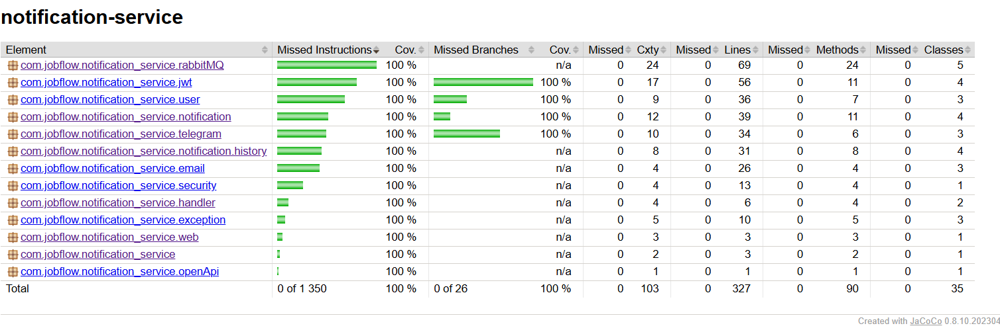

# notification-service

## Description

**notification-service** is the **event-driven notification engine** of JobFlow.
It listens to RabbitMQ queues and delivers real-time alerts to users via **Email** and **Telegram**, based on their
preferences and job tracking activity.
Each notification is fully traceable, safely retried on failure, and logged in a dedicated history store for auditing.
It also provides a secure Webhook integration for **Telegram Bot linking**, allowing seamless notification delivery to
verified users.

---

## Features

### Telegram Webhook Integration

- **`POST /telegram/webhook`** — receives Telegram `/start <JWT>` messages via Webhook
- **JWT extraction & validation** — validates the token, extracts `userId`, and links it with `chatId` by calling the `user-service` 
- **Secret verification** — validates secret passed by Telegram bot for security
- **Silent failure** — returns `200 OK` on all bot-side errors to avoid infinite retries

### Notification Consumption via RabbitMQ

- **RabbitMQ Queues & DLQ** — separate queues for Email & Telegram with DLQ fallback
- **Event Listeners** — consumers for `EMAIL` and `TELEGRAM` queues using `@RabbitListener`
- **Retry & Recovery** — auto-retry failed deliveries with backoff and DLQ after 3 failed attempts

### Notification Dispatch Logic

- **AbstractNotificationService** — shared logic for retrieving user contacts and dispatching notifications
- **Email & Telegram strategies** - each strategy implements `extractContact`, `sendNotification`, and `getType`
- **User info resolution** — calls `user-service` via REST with API key (contains `email` and `telegramChatId`)

### Notification Channels

- **Email** — uses `JavaMailSender` (Google SMTP) to send emails from events (subject + message)
- **Telegram** — uses Telegram Bot API to send messages to linked `chatId`s

### Notification History

- **Persistent storage** — stores history of sent notifications in PostgreSQL
- **Success & failure records** — includes `userId`, type, subject, message, `success`, `failureReason`, and timestamps
- **Find my notifications** — GET `/notifications/me` returns user’s successful notifications with pagination & sorting

### Security & Rate Limiting

- **JWT Authentication** — JWT token (issued by `user-service`) is validated on all protected endpoints
- **Custom Webhook Security** — verifies Telegram bot secret to prevent spoofed requests
- **Custom exception handling** — provides clear error messages, while avoiding infinite retry loops

### Developer Experience

- **Swagger / OpenAPI 3.0** — Interactive API docs with Swagger.
- **100 % test coverage** — JUnit 5, Mockito, Testcontainers, JaCoCo, Awaitility for RabbitMQ tests.
- **Structured logging** — Logback JSON; integrates with ELK stack.

## Installation & Running

This guide helps you run the project from scratch using **Docker Compose**. No pre-installed services required —
everything is containerized.

### 1. Prerequisites

Make sure you have installed:

- [Docker](https://docs.docker.com/get-docker/)
- [Docker Compose](https://docs.docker.com/compose/)

### 2. Clone the Repository

```bash
git clone https://github.com/malyga99/job-flow.git
cd job-flow/notification-service
```

### 3. Configure environment variables

Create a .env file in the project root by copying the example:

```bash
cp .env.example .env
```

### 4. Run the application

Start the backend and all services using Docker Compose:

```bash
docker-compose up --build
```

Access the Services:

| Service        | Port(s) | UI                                                                                         |
|----------------|---------|--------------------------------------------------------------------------------------------|
| **API Docs**   | `8082`  | [http://localhost:8082/swagger-ui/index.html](http://localhost:8082/swagger-ui/index.html) |
| **PostgreSQL** | `5434`  | –                                                                                          |

### Notes:

- **Service health:** Wait until all services become "healthy" when starting docker-compose. This is critical for the
  backend to work
  correctly, as Spring Boot waits for them to be ready before starting. You can check the status with the command:
  `docker ps`
- **Stop and remove containers**: To stop and remove containers and volumes, use: `docker-compose down -v`
- **Ports**. The ports in table depend on what you specified in `docker-compose.yml`
- **job-tracker-service**. Make sure that you have the job-tracker-service running, as the notification-service connects to RabbitMQ running from there.

## Testing & Coverage

To run tests locally:

```bash
./mvnw test
```

To generate the test coverage report:

```bash
./mvnw verify
```

The HTML coverage report will be available in `target/site/jacoco/index.html`.

> Current test coverage is **100%**, including branches and lines.

### Coverage Report (Jacoco)

<details>
<summary>Jacoco Coverage</summary>

</details>