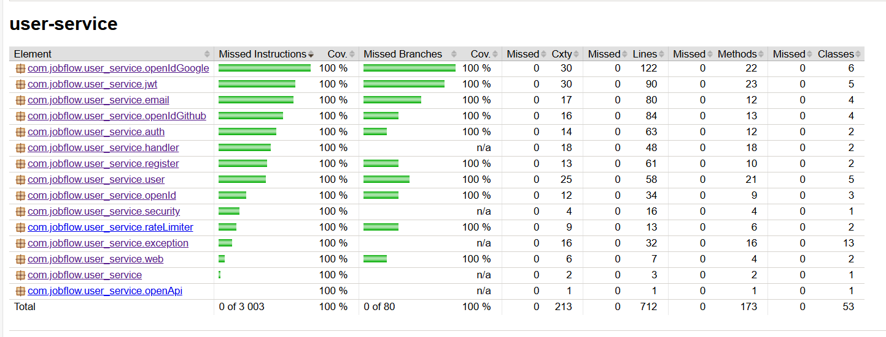

# user-service

## Description

**user-service** is the **authentication and profile core** of JobFlow.  
It provides classic email / password login, social sign‑in (Google & GitHub), secure JWT token lifecycle, and exposes
user contact data for other micro‑services.  
All flows are rate‑limited and fully tested, ensuring the entire JobFlow platform has a single, hardened source of truth
for user identity.

---

## Features

### Authentication & Token Flow

- **Email / Password login** — returns **JWT access / refresh** pair
- **Token refresh** — validates refresh, checks Redis blacklist, issues new access
- **Logout** — adds refresh token ID to Redis blacklist (TTL = token lifetime)

### Registration & Email Verification

- **Registration with email verification** — stores full registration request and confirmation code in Redis until
  verified
- **6‑digit email code** — sent via `JavaMailSender` (Google SMTP), valid 5 min
- **Resend & Confirm** — safe resending with TTL check; on success persists user and returns tokens

### Social Login (OAuth 2.0 / OpenID)

- **Google & GitHub providers** — pluggable strategy map
- **ID‑token validation** — Google JWK Set cached in Redis
- **First‑login auto‑provisioning** — creates user from provider claims

### Security & Rate Limiting

- **Redis Rate Limiter (Fixed Window)** — per‑endpoint rules (IP + login + userId)
- **Custom exception handler** — all business and validation errors return unified JSON responses
- **RBAC via Spring Security** — resource‑level access control
- **Inter‑service API keys** — lightweight auth for internal REST calls

### User Info & Telegram Linking

- **`GET /users/{id}`** — email + Telegram chat ID (for inter‑service calls)
- **`POST /telegram/link`** — users send `/start <JWT>` to the Telegram bot; service stores chat ID for notifications

### Developer Experience

- **Swagger / OpenAPI 3.0** — Interactive API docs with Swagger
- **100 % test coverage** — JUnit 5, Mockito, Testcontainers, JaCoCo
- **Structured logging** — Logback JSON; integrates with ELK stack

---

## Installation & Running

This guide helps you run the project from scratch using **Docker Compose**. No pre-installed services required —
everything is containerized.

### 1. Prerequisites

Make sure you have installed:

- [Docker](https://docs.docker.com/get-docker/)
- [Docker Compose](https://docs.docker.com/compose/)

### 2. Clone the Repository

```bash
git clone https://github.com/malyga99/job-flow.git
cd job-flow/user-service
```

### 3. Configure environment variables

Create a .env file in the project root by copying the example:

```bash
cp .env.example .env
```

### 4. Run the application

Start the backend and all services using Docker Compose:

```bash
docker-compose up --build
```

Access the Services:

| Service        | Port(s)        | UI                                                                                         |
|----------------|----------------|--------------------------------------------------------------------------------------------|
| **API Docs**   | `8080`         | [http://localhost:8080/swagger-ui/index.html](http://localhost:8080/swagger-ui/index.html) |
| **PostgreSQL** | `5432`         | –                                                                                          |
| **Redis**      | `6379`, `8001` | [http://localhost:8001](http://localhost:8001)                                             |

### Notes:

-  **Service health:** Wait until all services become "healthy" when starting docker-compose. This is critical for the
   backend to work
   correctly, as Spring Boot waits for them to be ready before starting. You can check the status with the command:
   `docker ps`
- **Stop and remove containers**: To stop and remove containers and volumes, use: `docker-compose down -v`
- **Ports**. The ports in table depend on what you specified in `docker-compose.yml`

## Testing & Coverage

To run tests locally:

```bash
./mvnw test
```

To generate the test coverage report:

```bash
./mvnw verify
```

The HTML coverage report will be available in `target/site/jacoco/index.html`.

> Current test coverage is **100%**, including branches and lines.

### Coverage Report (Jacoco)

<details>
<summary>Jacoco Coverage</summary>

</details>